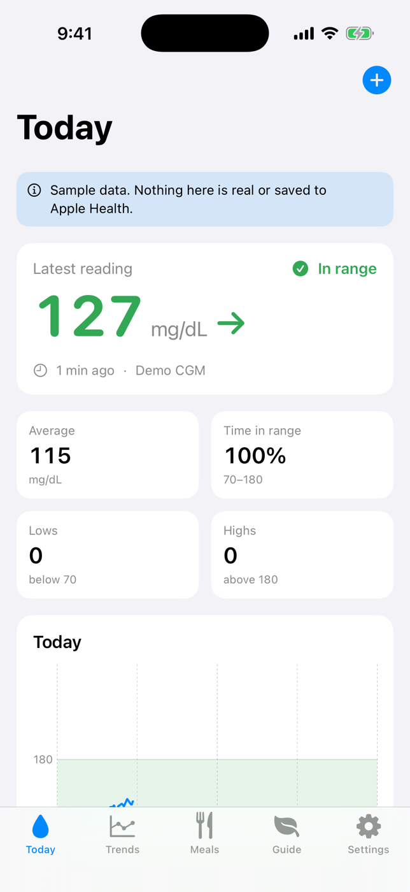
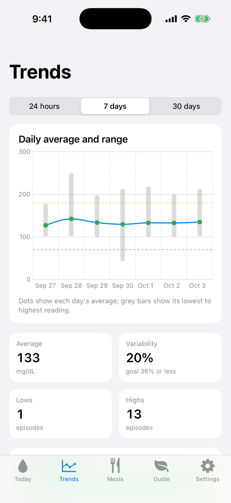
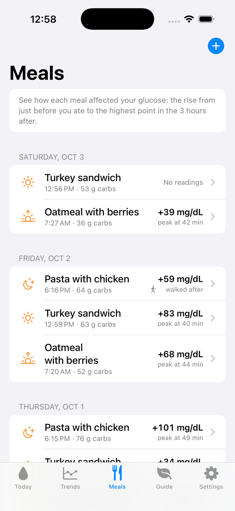
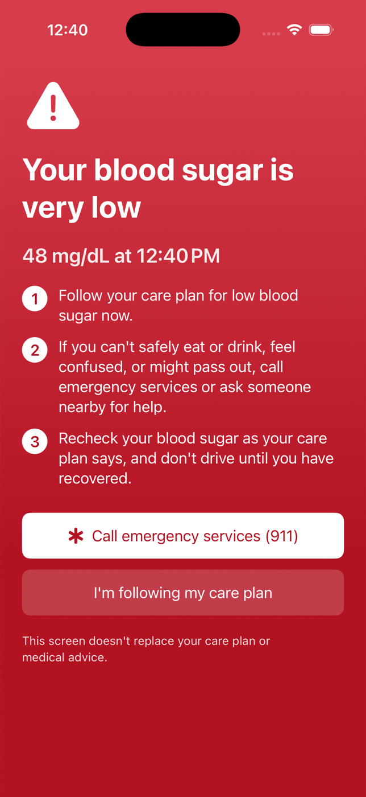
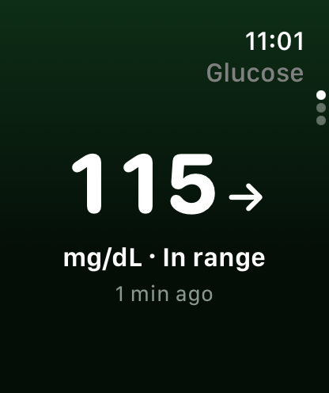

# Gluvio

An iPhone and Apple Watch app that helps people with Type 2 diabetes track
blood sugar, understand their daily trends, and learn how meals and activity
affect their glucose.

> **Not a medical device.** The app does not give insulin or medication dosing
> advice and is not a substitute for medical care. Users are told to consult
> their doctor before changing diet, exercise or medication.

## Screenshots

CI builds the app, runs it in the simulator with sample data, and commits these
screenshots to `docs/screenshots/`.

| Today | Trends | Meals | Urgent guidance | Apple Watch |
|---|---|---|---|---|
|  |  |  |  |  |

## What's built

**iPhone (iOS 17+)**
- Onboarding: medical disclaimer that must be accepted, units, target range,
  CGM or fingerstick, Apple Health and notification permission primers
- Today: latest reading with trend arrow and age, today's average, time in range,
  lows and highs, a chart with meals and walks marked, steps and active minutes
  against goals, one practical suggestion
- Trends: 24-hour, 7-day and 30-day charts, time in ranges, variability, an
  estimated A1C (GMI for CGM data), and insights such as "meals followed by a
  walk rose X less"
- Meals: log type, carbs (with quick-add for common foods), photo and notes;
  see each meal's glucose rise and time to peak
- Guide: plate method diagram, low-GI swaps, exercise ideas
- Urgent guidance screen for very low or very high readings, with one-tap calls
  to a care contact and the local emergency number
- Reminders (glucose checks, medication labels, activity, water, walk after meals)
- Doctor report as a PDF, shared only when the user taps Share
- Home Screen and Lock Screen widgets
- Sample-data mode for exploring the app and for App Review

**Apple Watch (watchOS 10+)**
- Latest reading with trend arrow, age and range color
- Today's time in range and the last 3 hours
- Quick log: glucose (Digital Crown), meal carbs, water
- Complications for the latest reading and time in range
- An informational haptic for out-of-range readings; reminders mirror from iPhone

## Project layout

```
project.yml               XcodeGen spec for all five targets
App/                      iPhone app (MVVM: Features/<Feature>/View + ViewModel)
Watch/                    Apple Watch app
Widgets/                  Widgets and complications (one source, two targets)
Shared/                   Band colors and the privacy manifest, used by every target
Packages/GlucoseKit/
  Sources/GlucoseCore     Models, units, ranges, analytics, safety copy, sample data
  Sources/GlucoseHealth   HealthKit service behind a protocol, plus a demo service
  Sources/GlucoseStorage  SwiftData mirror of Apple Health and meal records
  Sources/GlucoseReport   Command-line demo report
  Tests/GlucoseCoreTests  Unit tests for the medical math and safety rules
scripts/                  Build, run and screenshot script used by CI
docs/                     Architecture, MVP scope, screenshots
```

## Try it on your Mac

With Xcode installed (free from the Mac App Store), one command builds Gluvio and
opens it in the iPhone and Apple Watch simulators:

```bash
git clone https://github.com/venkatsatish-byte/Gluvio.git
cd Gluvio
./scripts/run-on-mac.sh --demo --watch
```

Leave out `--demo` to start at the welcome screen with no data, and `--watch`
to skip the Watch app.

## Build and run

Needs a Mac with Xcode 16 or newer and [XcodeGen](https://github.com/yonaskolb/XcodeGen).

```bash
brew install xcodegen
git clone https://github.com/venkatsatish-byte/Gluvio.git
cd Gluvio
xcodegen generate
open Gluvio.xcodeproj
```

Then pick the **Gluvio** scheme and an iPhone simulator, and run.
To explore with sample data, tap **Explore with sample data** on the welcome
screen, or add `-demoMode YES` under the scheme's launch arguments.

To run on your own iPhone and Apple Watch, edit `project.yml`:
- `DEVELOPMENT_TEAM`: your Apple Developer team ID
- `APP_BUNDLE_ID`: an identifier you own, e.g. `com.yourname.gluvio`
- `APP_GROUP_ID`: `group.` + the same identifier

HealthKit needs a paid Apple Developer account.

### Without Xcode

The analytics, tests and a text version of the report run anywhere Swift does:

```bash
cd Packages/GlucoseKit
swift test
swift run glucose-report                 # 30 days of sample CGM data
swift run glucose-report --fingerstick --mmol
```

## Test on your iPhone and Apple Watch

The **TestFlight** workflow (Actions → TestFlight → Run workflow) builds, signs
and uploads Gluvio to TestFlight. It needs a one-time setup in your Apple
Developer account: see [docs/TESTFLIGHT.md](docs/TESTFLIGHT.md).

## Design documents

| Document | Contents |
|---|---|
| [docs/ARCHITECTURE.md](docs/ARCHITECTURE.md) | MVVM architecture, targets, data models, HealthKit and sync strategy, safety design |
| [docs/MVP_SCOPE.md](docs/MVP_SCOPE.md) | MVP, v1 and v2 scope, App Store review notes, open questions |
| [docs/TESTFLIGHT.md](docs/TESTFLIGHT.md) | One-time setup for TestFlight builds on your iPhone and Apple Watch |

## Before shipping

- Clinical review of all safety and guidance wording (`SafetyCopy`, `GuideContent`)
- Regulatory review if real-time CGM alerts are added
- App Store screenshots and description (the app icon is in `App/Assets.xcassets`; `scripts/make-icon.py` redraws it)
- A privacy policy URL (required for HealthKit apps)
